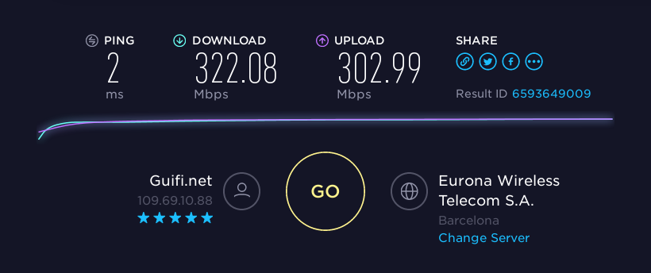
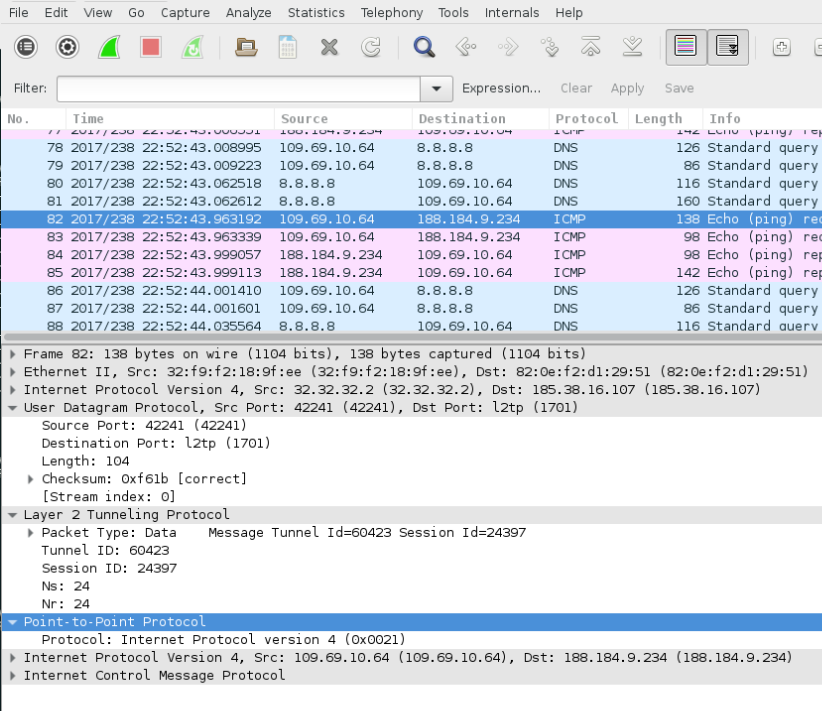

# Servei d'accés a Internet per L2TP Aggregation Architecture (LAA)

Autor: Víctor Oncins

Com a novetat es planteja un nou router d'accés per usuaris específics (ITConic-LNS) que permeti l'accés directe a Internet a través d'un procés d'AAA. Aquest nou paradigma d'accés permetria:

* Control centralitzat de l'accés
* Autenticació de la subscripció (local, PAM, RADIUS, ...)
* Assignació dinàmica d'adreces públiques o de Guifi.net
* Establiment sota arquitectura client-servidor, cosa que elimina els possible problemes de NAT i DNS dinàmics que es donen amb els túnels estàtics GRE/IPIP

Una solució coneguda pels ISPs per aquest tipus d'accés és l'arquitectura L2TP Aggregation Architecture o [LAA](https://www.broadband-forum.org/technical/download/TR-025.pdf). Aquesta solució es basa en una xarxa de commutació de paquets (L3 PSN) que en el nostre cas pot ser Guifi.net o les xarxes amb peering de la FXOLN. L'escenari contemplat seria el següent:

```
               SN/Client                  L3 PSN                PoP-IX  

+-----------+           +-----------+    +------+    +-------+          +------+
|           |           |           |    |      |    |       |          |      |
| PC1/ CPE1 +-----------+           +<-----L2TP----->+       |          |      |
|           |<==PPPoE==>*<=========>*<====PPP+AAA===>|       |          |  IX  |
+-----------+           |           |    |      |    |       +--VLAN95--+      +->FXOLN
+-----------+           |    LAC    |    |      |    |       |          |      |
|           |           |           |    |      |    |       |          |      |
| PC2/ CPE2 +-----------+           |    |      |    |       |          |      |
|           |<==PPPoE==>*<=========>*<====PPP+AAA===>+  LNS  |          |      |
+-----------+           +-----------+    |      |    |       |          |      |
                                         |      |    |       |          |      |
  +---------+           +-----------+    |      |    |       |          +------+
  |         |           |    LAC    |    |      |    |       |
  |   PC    +-----------+   usuari  +<-----L2TP----->+       |          +------+
  |         |           |    NAT    |<====PPP+AAA===>|       |<==AAA===>|RADIUS|
  +---------+           +-----------+    +------+    +-------+          +------+
```

Els Border Network Gateway (BNG) fan servir les funcions de LAC i LNS de L2TP però redirigint els paquets PPPoE cap el LNS. Aquest paradigma de connexió té cert avantatges:

 * Permet connectar múltiples CPE de usuari situats en el mateix emplaçament, és a dir emprant els mateixos punts extrems L2TP
 * PPPoE és un protocol implementat per molts fabricants, distribucions de routing i dispositius personals

Tanmateix la implementació de la LAA requereix de més anàlisi. Tot i que les distribucions basades en Linux (VyOS i OpenWRT) suporten l'establiment de túnels L2TP per PPP, la funcionalitat prevista requereix una implementació que permeti que els paquets PPPoE generats pel CPE d'usuari s'encapsulin dins un túnel L2TP. És a dir, que elimini les capceleres Ethernet i el procés de AAA i IPCP es faci directament entre el CPE i ITConic (LNS). Per la funció de LAC forwarder només hem trobat una distribució de codi obert que és [BSDRP](https://bsdrp.net/) (FreeBSD). El següent quadre resumeix les funcions suportades per cada implementació:


| Distribució     | L2TP LAC forwarder |L2TP LAC no-IPsec |L2TP LNS no-IPsec | 
| ----------------| ------------------ |----------------- |------------------|
| RouterOS 6.38.X | NO                 | SI               | SI               |
| VyOS 1.1.7      | NO                 | NO               | NO               |
| BSDRP 11.1      | SI                 | SI               | SI               |
| OpenWRT CC      | NO                 | SI               | SI               |

Com veiem BSDRP seria la millor opció per dur a terme la funció de [LAC forwarder](https://bsdrp.net/documentation/examples/pppoe_and_l2tp_lab?s[]=l2tp). Tanmateix tenim opció de fer servir RouterOS i OpenWRT com a LNS. L'ús de BSDRP en un entorn KVM presenta l'inconvenient que el rendiment de les interfícies de xarxa VirtIO no supera mai els 700Mbps, amb un màxim teòric de 10Gbps. Sembla que aquest és un problema general d'aquesta distribució. Tenim opció de fer servir OpenWRT o RouterOS. Aquest darrer ha presentat problemes en el moment en que fa routing entre les interficies PPP i Ethernet. Pel que sembla deixa de funcionar el protocol ARP en aquesta interfície. Pot estar relacionat amb el driver VirtIO de RouterOS ja que si es fa servir un E1000 aquest problema no es reprodueix. Queda pendent provar-ho amb OpenWRT i avaluar-ne els rendiments.

S'han fet proves en entorn real en un node, el qual incorpora un LAC amb BSDRP. En aquest cas es disposa d'una connexió FTTH de 300/300 Mbps que fa peering amb la FXOLN. Es disposa d'un Proxmox 5.0-32 amb VMs amb diferents sistemes operatius, un d'ells el BSDRP.

El LAC tenia aquesta configuració:

```
/usr/local/etc/mpd5/mpd.conf:

startup:
    set user bsdrp bsdrp
    # configure the console
    set console self 127.0.0.1 5005
    set console open

default:
    load simple_lac

simple_lac:
    create link template L1 pppoe
    set pppoe iface vtnet0
    set link action forward L2
    set link enable incoming

    create link template L2 l2tp
    set l2tp peer 185.32.16.105

/etc/rc.conf:

###### BSD Router Project Base Configuration ########

# /etc/rc.conf: This file, put your configuration here
# /etc/rc.conf.misc: Special BSDRP configuration parameters (polling, somes sysctl tunning)
# /etc/default/rc.conf: Default FreeBSD value and some examples (Do not edit this file!)

# Hostname
hostname="finalac"

# Enable routing
gateway_enable="NO"
ipv6_gateway_enable="NO"

# Enable IPv6
ipv6_activate_all_interfaces="YES"

# Enable Router Advertisment:
rtadvd_enable="NO"
rtadvd_interfaces="em0"

#Waiting for a default route
defaultroute_delay="5"
mpd_enable="YES"
sshd_enable="YES"
mpd_flags="-b -s ppp"
ifconfig_vtnet2="192.168.50.7/24"
defaultrouter="192.168.50.1"
frr_enable="YES"
ifconfig_vtnet1="192.168.31.7/24"
```

El LNS era a ITConic (185.32.16.105) amb un Router OS físic. Les configuracions eren les estàndard per un LNS L2TP. En aquest cas s'ha activat un client PPPoE en un PC connectat a la VLAN d'accés del LAC. Un cop enllestit el procés d'autenticació, hem obtingut el rendiment de la connexió PPPoE que es pot veure a la imatge.



L'encapsulament ocupa entre 16 i 20 bytes extra corresponents a la capçelera UDP, L2TP i PPP. Suman-t'hi els 20 bytes de la capçelera IP obtenim una MTU d'usuari de entre 1464 i 1460. Podem veure un detall del contingut d'un paquet enviat per l'usuari.


